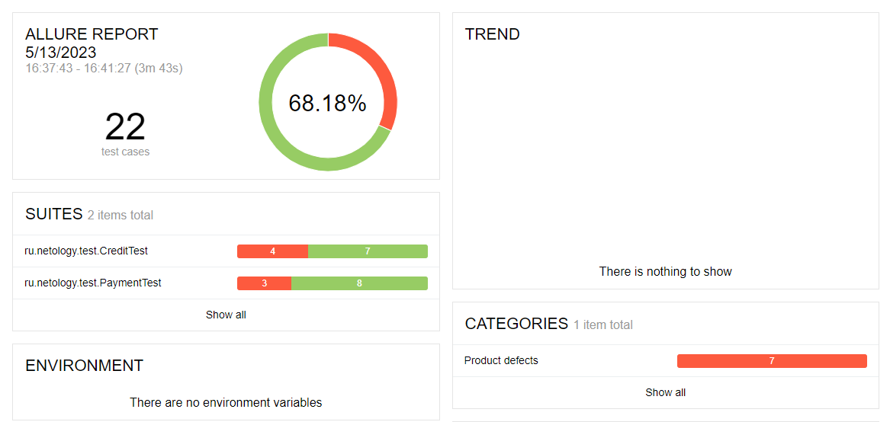
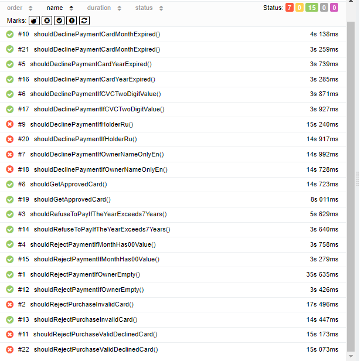
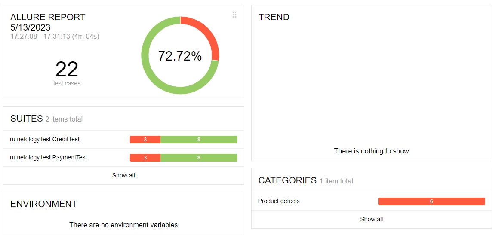
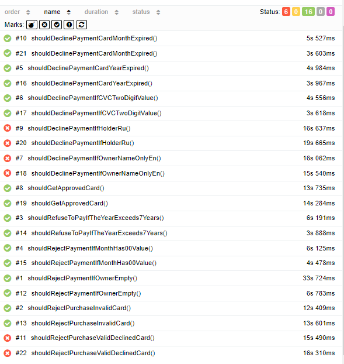

Отчет по итогам проведенного тестирования
---
**Краткое описания**
***

Проведено автоматизированное тестирование сервиса покупки туров, взаимодействующего с СУБД, согласно [плану](https://github.com/Daria-Tiko/Diploma/blob/main/Doc/Plan.md) тестирования.

**Количество тест кейсов**

Создано 22 тест-кейса

для MySQL: (http://192.168.0.104:54092/index.html#behaviors)

* пройдено успешно: 15
* тестов провалено: 7

для PostresSQL: (http://192.168.0.104:55342/index.html#)

* пройдено успешно: 16
* тестов провалено: 6

**Общие рекомендации**
***
1. Необходима документация на продукт для более точного понимания специфики тестирования продукта;
2. Сообщения о необходимости заполнения полей формы привести к единому формату;
3. Сделать недоступной покупку тура картой недопустимой к оплате;
4. Поле "Владелец" должно принимать только латиницу и формат "Name/Surname";
5. В поле "Год" недопустима подсказка прошедшего года, что может привести к ошибочному заполнению.
6. При заполнении хоть одного поля данными не соответствующими правилам кнопку "Продолжить" целесообразно сделать неактивной.

